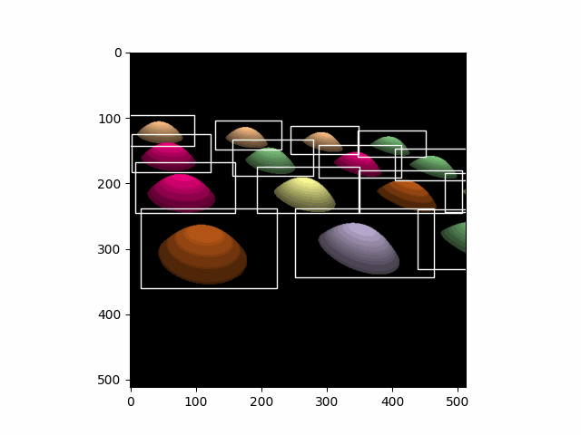

# Quadratic Gaussian Splatting for Efficient and Detailed Surface Reconstruction

[Project page](https://quadraticgs.github.io/QGS/) | [Paper](https://arxiv.org/pdf/2411.16392) | [Quadric Serfel Rasterizer (python)](./quadratic_demo.py)

<div style="text-align: center;">
  <figure style="margin: 0;">
    
  </figure>
</div>

This repo contains the official implementation for the paper “Quadratic Gaussian Splatting for Efficient and Detailed Surface Reconstruction.”
Following [2DGS](https://github.com/hbb1/2d-gaussian-splatting), we also provide a [Python demo](./quadratic_demo.py) that demonstrates the differentiable rasterization process for quadratic surfaces:
<div style="display: flex; gap: 10px;">
  <figure style="margin: 0;">
    
  </figure>
  <figure style="margin: 0;">
    
  </figure>
  <figure style="margin: 0;">
    
  </figure>
</div>

## Installation

```dockerfile
# download
git clone https://github.com/QuadraticGS/QGS.git

conda env create -f environment.yml
```

## Training

To train a scene, simply use

```
python train.py --conf_path ./config/base.yaml
```

In `base.yaml`, you can adjust all configurable parameters, with most parameters remaining consistent with 2DGS. Furthermore, we have briefly experimented with curvature-related losses, such as curvature distortion loss and curvature flatten loss. Unfortunately, their performance was not satisfactory.

**Tips for adjusting the parameters on your own dataset:**

- We observed that setting `pipeline.depth_ratio=1` enhances rendering quality. Additionally, by employing per-pixel reordering, we effectively eliminate the "disk-aliasing" artifacts present in 2DGS when using `depth_ratio=1`. Therefore, we recommend using `pipeline.depth_ratio=1` when aiming to improve rendering quality. 
- In most scenarios, we recommend adjusting the `optimizer.densify_grad_threshold` and `optimizer.lambda_dist` parameters to achieve better reconstruction. The former controls the number of Gaussian primitives, while the latter controls the compactness of the primitives.
- For large scenes, especially aerial or street views, we suggest adjusting the number of training iterations based on the number of images. We provide `TNT_Courthouse.yaml` as an example.

## Testing

To extract scene geometry, simply use:

```dockerfile
python render.py --conf_path ./config/base.yaml -m <path to pre-trained model>
```

In the `pipeline` section of the `base.yaml` configuration file, you can set various parameters for mesh extraction, maintaining the same meanings as those in 2DGS.

## Evaluation

For geometry reconstruction on the DTU dataset, please download the preprocessed data from [Drive](https://drive.google.com/drive/folders/1SJFgt8qhQomHX55Q4xSvYE2C6-8tFll9) or [Hugging Face](https://huggingface.co/datasets/dylanebert/2DGS). You also need to download the ground truth [DTU point cloud](https://roboimagedata.compute.dtu.dk/?page_id=36).

Next, modify the `DTU.yaml` configuration file by setting the `load_model_path` to the path of your trained model and `dataset_GT_path` to the path of the ground truth dataset. After making these changes, simply execute the following commands to perform the evaluation:

```docker
python scripts/eval_dtu/eval.py --conf_path ./config/DTU.yaml -m <path to pre-trained model>
```

For the TNT dataset, please download the preprocessed [TNT_data](https://huggingface.co/datasets/ZehaoYu/gaussian-opacity-fields/tree/main). Additionally, you need to download the ground truth [TNT_GT](https://www.tanksandtemples.org/download/).

Next, modify the `TNT.yaml` configuration file by setting `load_model_path` to the path of your trained model and `dataset_GT_path` to the path of the ground truth dataset. After making these changes, simply execute the following commands to perform the evaluation:

```
python scripts/eval_tnt/run.py --conf_path ./config/TNT.yaml -m <path to pre-trained model>
```
## Acknowledgements

This project is built upon [2DGS](https://github.com/hbb1/2d-gaussian-splatting). The TSDF fusion for extracting mesh is based on [Open3D](https://github.com/isl-org/Open3D). The rendering script for MipNeRF360 is adopted from [Multinerf](https://github.com/google-research/multinerf/), while the evaluation scripts for DTU and Tanks and Temples dataset are taken from [DTUeval-python](https://github.com/jzhangbs/DTUeval-python) and [TanksAndTemples](https://github.com/isl-org/TanksAndTemples/tree/master/python_toolbox/evaluation), respectively. We thank all the authors for their great repos.

## Citation

If you find our code or paper helps, please consider citing:
```bibtex
@misc{zhang2024quadraticgaussiansplattingefficient,
      title={Quadratic Gaussian Splatting for Efficient and Detailed Surface Reconstruction}, 
      author={Ziyu Zhang and Binbin Huang and Hanqing Jiang and Liyang Zhou and Xiaojun Xiang and Shunhan Shen},
      year={2024},
      eprint={2411.16392},
      archivePrefix={arXiv},
      primaryClass={cs.CV},
      url={https://arxiv.org/abs/2411.16392}, 
}
```


